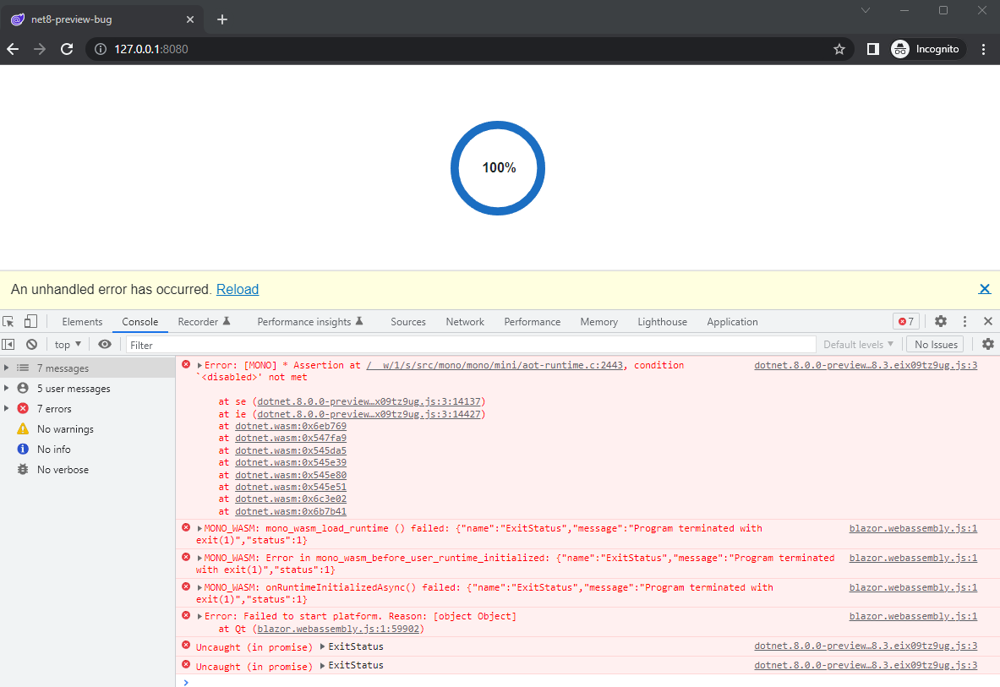

# How to reproduce the bug

1. Publish the project in release mode ``dotnet publish -o ./output``
1. Navigate to the output folder ``cd ./output/wwwroot``
1. Serve static content using some static server e.g. [http-server](https://www.npmjs.com/package/http-server) ``http-sever``
1. Go to http://localhost:8080 and open the browser console 
